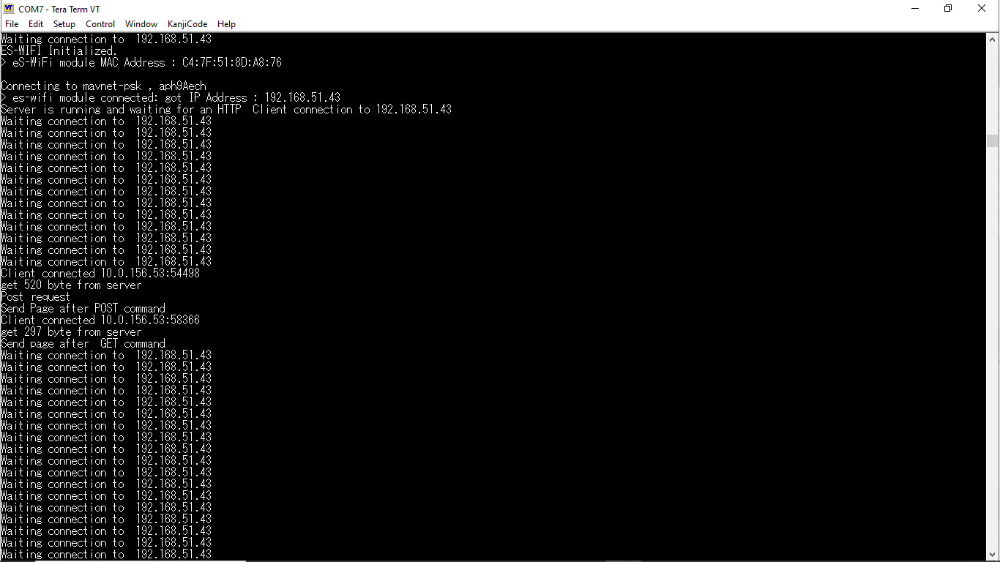
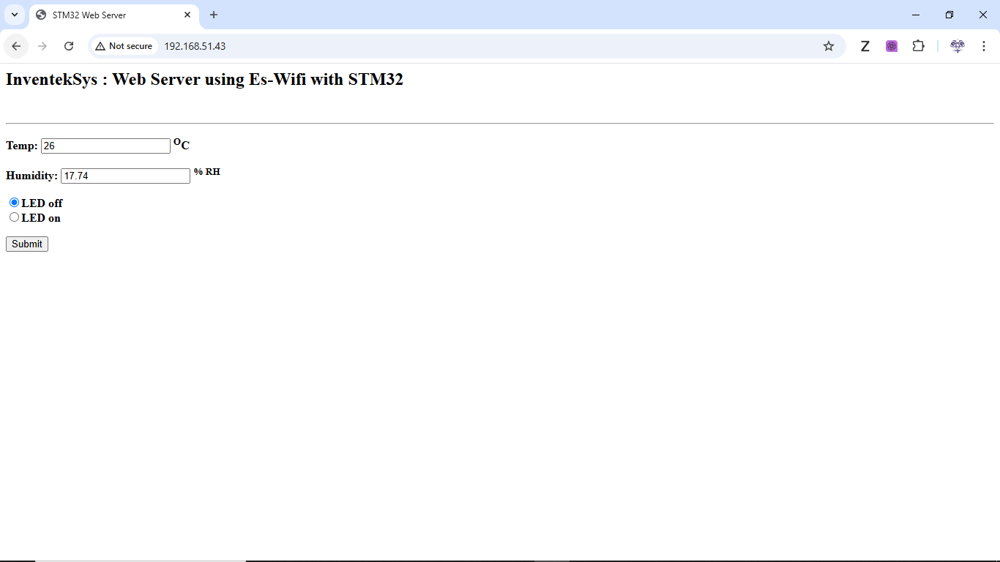

# STM32 IoT Sensor Web Server

**Embedded C · STM32CubeIDE · Wi-Fi · HTTP Server · Sensor Acquisition · ST-Link Serial Debugging**

## Overview

This project is an embedded IoT sensor web server built on the **STM32 B-L475E-IOT01A Discovery Board**. The firmware reads onboard environmental sensor data, including temperature and humidity, and exposes the live readings through a lightweight HTTP web server over Wi-Fi.

A client connected to the same network can open a web browser, enter the STM32 device IP address, and view real-time environmental readings served directly from the microcontroller.

This project demonstrates embedded firmware development, sensor acquisition, Wi-Fi networking, HTTP server operation, serial debugging, and hardware/software integration on an STM32 platform.

---

## What This Project Demonstrates

- Embedded C firmware development on STM32 hardware
- Sensor data acquisition from onboard environmental sensors
- Wi-Fi initialization and network connectivity
- Lightweight HTTP server operation on an embedded device
- Browser-based monitoring of live microcontroller sensor data
- Serial debugging through ST-Link Virtual COM port
- Hardware/software integration and real-device validation
- Local-network IoT device communication

---

## Quick Results

| Feature | Result |
|---|---|
| Target Board | STM32 B-L475E-IOT01A Discovery Board |
| Firmware Language | C |
| IDE / Toolchain | STM32CubeIDE |
| Sensor Data | Temperature and humidity |
| Connectivity | Wi-Fi |
| Interface | Browser-based HTTP page |
| Debugging | ST-Link Virtual COM serial output |
| Validation | Device IP accessed from browser on same network |

---

## System Architecture

The system follows a simple embedded IoT data pipeline:

```text
Onboard Sensors
      ↓
Sensor Driver / Acquisition Logic
      ↓
STM32 Firmware Application
      ↓
Wi-Fi Network Interface
      ↓
Embedded HTTP Server
      ↓
Browser Client on Local Network
```

The firmware collects environmental data from the onboard sensors, formats the readings, and serves them over Wi-Fi through an embedded HTTP server.


---

## Hardware Platform

Target board:

**STM32 B-L475E-IOT01A IoT Discovery Board**

Key hardware components used:

- STM32L475 microcontroller
- Onboard temperature sensor
- Onboard humidity sensor
- Integrated Wi-Fi module
- ST-Link debugger for flashing and serial communication

---

## Firmware Design

The firmware is responsible for sensor acquisition, networking initialization, HTTP server behavior, and debug output.

Main firmware file:

[main.c](firmware/main.c)

### Firmware Responsibilities

- Initialize MCU peripherals
- Configure onboard sensors
- Acquire temperature and humidity readings
- Initialize Wi-Fi connectivity
- Start the embedded HTTP server
- Serve live sensor readings to browser clients
- Print connection status and IP address through serial output
- Support debugging through ST-Link Virtual COM

---

## Data Flow

```text
Temperature / Humidity Sensors
      ↓
STM32 Firmware Reads Sensor Values
      ↓
Sensor Data Formatted for Web Output
      ↓
HTTP Server Responds to Browser Request
      ↓
Client Browser Displays Live Readings
```

This allows a user to monitor environmental conditions using only a browser on the same local network.

---

## Demonstration

When the system starts, the device connects to Wi-Fi and prints the assigned IP address to the serial terminal.

Example serial output:

```text
WiFi Connected
IP Address: 192.168.35.11
HTTP Server Started
```

A client device can open a browser and navigate to the printed IP address to view sensor readings.

Example browser output:

```text
Temperature: 24°C
Humidity: 45%
```

---

## Example Output

### Serial Console — ST-Link Virtual COM

The device prints Wi-Fi connection status and the assigned IP address to the serial terminal.



### Browser Interface

A client on the same local network can access the device using the printed IP address.



---

## Development Environment

This project was developed using:

- STM32CubeIDE
- C programming language
- STM32 HAL / board support libraries
- ST-Link debugger
- ST-Link Virtual COM serial interface
- Tera Term serial terminal
- Browser client for HTTP output validation

---

## Quick Start

### 1. Open the project

Open the firmware project in **STM32CubeIDE**.

### 2. Build the firmware

Build the project using the STM32CubeIDE build system.

### 3. Flash the board

Flash the firmware to the **STM32 B-L475E-IOT01A Discovery Board** using ST-Link.

### 4. Open a serial terminal

Open a serial terminal such as **Tera Term** and connect to the ST-Link Virtual COM port.

### 5. Read the assigned IP address

After Wi-Fi connection, the board prints the assigned IP address to the serial console.

### 6. Open the web page

Open a browser on a device connected to the same network and navigate to the printed IP address.

The browser will display the current temperature and humidity readings served by the STM32 board.

---

## How to Use

1. Power the STM32 B-L475E-IOT01A Discovery Board.
2. Flash the firmware through STM32CubeIDE.
3. Open the serial terminal through ST-Link Virtual COM.
4. Wait for Wi-Fi connection confirmation.
5. Copy the printed IP address.
6. Open the IP address in a web browser.
7. View live temperature and humidity readings.

---

## Limitations

- The HTTP server is intended for local-network monitoring, not public internet deployment.
- HTTPS/TLS is not implemented in the current prototype.
- The web interface is lightweight and focused on displaying sensor readings.
- Sensor readings depend on onboard sensor availability and board configuration.
- Wi-Fi credentials and network configuration may require local setup before deployment.
- The project was validated as an academic embedded IoT prototype rather than a production IoT device.

---

## Future Improvements

Potential future improvements include:

- Add REST-style JSON endpoint for sensor data
- Add browser auto-refresh for live updates
- Add timestamped sensor readings
- Add error handling for Wi-Fi disconnect/reconnect events
- Move Wi-Fi credentials to a configuration file or secure provisioning method
- Add MQTT support for IoT messaging
- Add cloud dashboard integration for remote monitoring
- Add HTTPS/TLS support for secure communication
- Add local or cloud-based data logging
- Add support for additional sensors

---

## Project Structure

```text
.
├── docs/                  # Diagrams, screenshots, and documentation images
├── firmware/              # STM32 firmware source files
├── PROJECT_OVERVIEW.md    # Additional project notes or overview
├── README.md              # Project documentation
└── LICENSE
```

---

## Key Takeaways

This project demonstrates a complete embedded IoT workflow using STM32 hardware:

```text
Sensor Acquisition → Firmware Processing → Wi-Fi Connectivity → HTTP Server → Browser-Based Monitoring
```

The project strengthened my experience with embedded C, STM32 development, sensor integration, Wi-Fi communication, serial debugging, and hardware/software validation on a real microcontroller platform.

---

## Author

**Oluwaferanmi Arowoshola**  
M.S. Electrical & Computer Engineering  
Embedded Systems · Firmware · IoT · Hardware/Software Integration

## License

This project is licensed under the MIT License.
