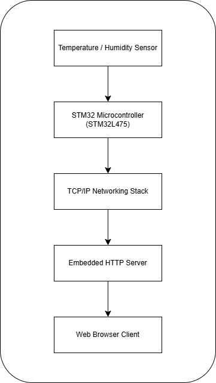

# STM32 IoT Sensor Web Server

Embedded IoT system built on the STM32 B-L475E-IOT01A Discovery Board that hosts a lightweight HTTP server and exposes environmental sensor data (temperature and humidity) over Wi-Fi.

The firmware acquires data from onboard sensors and serves the values to any client connected to the same network. A browser can access the device’s IP address and view live environmental readings in real time.

---

## Key Highlights

- Embedded firmware written in C using STM32CubeIDE
- Real-time temperature and humidity sensing
- Embedded HTTP server running directly on the microcontroller
- Wi-Fi connectivity enabling browser-based monitoring
- Serial debugging through ST-Link Virtual COM interface

---

## System Architecture

The system follows a simple embedded IoT pipeline:

Sensor Data → STM32 Firmware → Wi-Fi Stack → HTTP Server → Web Browser Client

- Sensors capture environmental data.
- STM32 firmware processes and formats readings.
- The networking stack exposes the data through an HTTP server.
- Clients access the readings through a browser interface.

---

## Hardware Platform

Target board:

STM32 B-L475E-IOT01A IoT Discovery Board

Key hardware components used:

- STM32L475 microcontroller
- Onboard temperature sensor
- Onboard humidity sensor
- Integrated Wi-Fi module
- ST-Link debugger for flashing and serial communication

---

## Firmware Design

The firmware is responsible for sensor acquisition, networking initialization, and HTTP request handling.

Main firmware file:

Key responsibilities of the firmware:

- Peripheral initialization
- Wi-Fi networking setup
- Environmental sensor data acquisition
- Embedded HTTP server operation
- Serial debugging output

---

## Demonstration

When the system starts, the device connects to Wi-Fi and prints the assigned IP address to the serial terminal.

Example serial output:

WiFi Connected  
IP Address: 192.168.35.11  
HTTP Server Started

A client device can open a browser and navigate to the IP address to view sensor readings.

Example browser output:

Temperature: 24°C  
Humidity: 45%

---

## Development Environment

- STM32CubeIDE  
- C programming language
- ST-Link debugger
- Tera Term serial terminal  

---

## Possible Extensions

Future improvements could include:

- HTTPS/TLS support for secure communication
- REST API interface for sensor access
- Cloud integration for remote monitoring
- Mobile or dashboard-based visualization 

---

## Author

Oluwaferanmi Arowoshola  
Electrical & Computer Engineering  
Minnesota State University, Mankato
